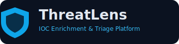

# ThreatLens



## IOC Enrichment & Triage Platform

**Desenvolvido por Patrick Santos**

ThreatLens é uma plataforma operacional para Blue Team/SOC voltada para enriquecimento de IOC, triagem com score explicável, central de casos, trilha de auditoria e suporte a investigação com KQL.

> O ThreatLens apoia a decisão do analista e **não executa bloqueios automáticos**.

## Funcionalidades

- Enriquecimento multi-fonte: VirusTotal, AbuseIPDB, URLhaus e IPinfo.
- Detecção de IOC: IPv4, domínio, URL, MD5, SHA1 e SHA256.
- Score de risco com `score_breakdown` e `confidence_level`.
- Dashboard SOC com distribuição por risco, tipo e status de caso.
- Central de Casos com edição de status, decisão e notas.
- Histórico com filtros e trilha de auditoria (`audit_logs`).
- Análise em lote (CSV/TXT) e exportação CSV.
- Exportação de relatório HTML com dados de caso.
- Launcher desktop (Tkinter) para iniciar/parar o app.
- Modo demo para validação visual sem API key.

## Screenshots sugeridos

- Dashboard com métricas SOC.
- Tela Analisar IOC com score + confiança.
- Central de Casos em edição.
- Launcher desktop em execução.

## Arquitetura

- `app.py`: roteamento principal da UI Streamlit.
- `core/`: detecção IOC, scoring, recomendações e KQL.
- `services/`: integrações HTTP com fontes OSINT.
- `database/`: SQLite, migração e auditoria.
- `views/`: telas funcionais do app.
- `utils/`: componentes visuais e estilos globais.
- `docs/`: documentação operacional e técnica.

## Instalação

```bash
cd threatlens
python -m venv .venv
source .venv/bin/activate  # Linux/macOS
# .venv\Scripts\activate   # Windows
pip install -r requirements.txt
```

## Configuração de API keys

Crie `.streamlit/secrets.toml` com:

```toml
VIRUSTOTAL_API_KEY = ""
ABUSEIPDB_API_KEY = ""
URLHAUS_API_KEY = ""
IPINFO_API_KEY = ""
```

Nunca exponha valores de chave em prints, logs ou commits.

## Execução via Streamlit

```bash
streamlit run app.py
```

## Execução via launcher desktop

```bash
python launcher.py
```

## Limitações

- Dependência de disponibilidade/rate limit de APIs externas.
- Não substitui investigação com telemetria interna.
- Resultados devem ser contextualizados pelo analista SOC.

## Roadmap

- RBAC e trilhas de aprovação por equipe.
- Integração com SIEM/SOAR.
- Exportação PDF nativa.
- Casos com anexos e timeline avançada.

## Uso responsável

- Não realizar bloqueios automáticos sem validação humana.
- Não enviar dados internos sensíveis para serviços externos sem política formal.

## Documentação adicional

- [Instalação](docs/installation.md)
- [Uso](docs/usage.md)
- [Arquitetura](docs/architecture.md)
- [Segurança](docs/security.md)
- [Roadmap](docs/roadmap.md)
